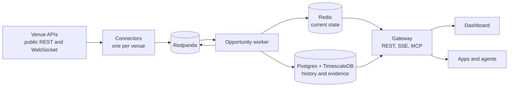

# Range

Range is a read-only intelligence service for tokenized-stock and equity-perpetual markets. It watches the same stocks across venues, prices cross-venue spread and funding opportunities against executable order-book depth and explicit costs, and shows the evidence behind every number. It holds no trading keys and never signs or submits orders.

**Live dashboard:** [range.datatides.xyz](https://range.datatides.xyz), public and read-only. It opens on Markets; the scanner is under Opportunities.

**Docs:** [range-2.gitbook.io/range-docs](https://range-2.gitbook.io/range-docs/): the quickstart, the API and MCP server for agents, and how Range prices a trade.

Hackathon focus: Track 1, arbitrage and funding opportunities.

**Live run records:** [records/2026-10-02-live](records/2026-10-02-live): every actionable result from eight hours of production, with the queries that produced them.

## What it does

- **Opportunity scanner.** Ten reviewed stock pairs, Bitget USDT-M perpetuals against trade.xyz perpetuals on Hyperliquid (HIP-3): NVDA, TSLA, AAPL, MSFT, META, AMZN, GOOGL, COIN, MSTR and HOOD. Each pair is evaluated continuously in both directions for price spreads and funding differentials at $2,500 notional. A result is actionable only while its net edge stays positive after costs; otherwise it is published as rejected, with its reasons.
- **Evidence for every result.** Each result carries its executable quotes, costs, freshness and an evidence bundle that pins every source observation (venue time, receive time and calculation version). A result stops being current within seconds of its inputs going stale, and a feed that misses a sequence number withdraws it.
- **Markets page.** Prices and funding for stock perpetuals across 12 venues, side by side by ticker, with Bitget first.
- **API and MCP for agents.** A REST and Server-Sent Events API with an OpenAPI spec, and an MCP server for AI agents with the same operations.
- **Unsigned intents.** For an actionable result, an authorized client can request an expiring, unsigned trade intent and revalidate it before acting. Range stops there: execution belongs to a separately authorized human or agent.

## How it works



1. **Connectors** read each venue's public feeds and publish listings, order books, funding and venue health as canonical events.
2. **The instrument registry** versions each listing's metadata. Reviewed mappings in [`config/instrument-mappings.json`](config/instrument-mappings.json) join listings to one underlying, such as `equity:NVDA`. Only those mappings can produce actionable results, and a listing whose metadata changes drops out of its mapping until it is reviewed again.
3. **The opportunity worker** keeps sequence-checked books and funding for every listing. For each reviewed pair it walks both books at the requested notional and nets out taker fees, a slippage buffer per leg, and funding projected over a one-hour hold. It publishes the result with its evidence, writes current state to Redis and history to Postgres, from which results can be replayed.
4. **The gateway** serves one application layer over REST, SSE and MCP, with scoped bearer tokens and per-operation rate limits.
5. **The dashboard** is a React app behind nginx, which adds a read-only token to API calls so the browser never holds one.

## Venues

| Venue | Role |
| --- | --- |
| Bitget | Primary venue. USDT-M perpetuals for the ten reviewed stocks are executable; its other stock-linked listings are reference data. |
| trade.xyz (Hyperliquid HIP-3) | The ten reviewed stocks are executable; other HIP-3 equity listings are reference data. |
| Extended, Ondo Perps | Reference data. |
| Bybit, Binance, Aster, Pacifica, Lighter, Variational, QFEX, Nado | Markets page only. |

The review behind the ten pairs, including the differences it accepted, is in [`docs/reviews/2026-09-30-bitget-hyperliquid.md`](docs/reviews/2026-09-30-bitget-hyperliquid.md). [`docs/operations/venue-enablement.md`](docs/operations/venue-enablement.md) describes how another venue or pair becomes executable.

## Running it

You need Node.js 22 or later (Corepack, bundled with Node, provides pnpm 11) and Docker with Compose.

```bash
corepack pnpm install
```

The gateway needs three secrets. Keep them in a file outside the repository:

```bash
cat > ../range.env <<EOF
RANGE_API_TOKEN_PEPPER=$(openssl rand -hex 32)
RANGE_DEMO_API_TOKEN=$(openssl rand -hex 32)
RANGE_DASHBOARD_READ_TOKEN=$(openssl rand -hex 32)
RANGE_PUBLIC_AGENT_TOKEN=$(openssl rand -hex 32)
EOF
```

Tokens must be 32 to 256 characters of `A-Z`, `a-z`, `0-9`, `_` and `-`. The demo token is for operators and can create intents; the dashboard token is read-only. Database passwords fall back to development-only values; set `RANGE_POSTGRES_PASSWORD` on any shared or internet-facing host. [`docs/operations/credentials.md`](docs/operations/credentials.md) lists every credential, including the optional read-only `EXTENDED_API_KEY`.

Start the stack:

```bash
docker compose -f infra/compose.yaml --env-file ../range.env up -d --build
```

The dashboard is at http://127.0.0.1:4173 and the API at http://127.0.0.1:8080; every port binds to 127.0.0.1 only. [`docs/operations/runbook.md`](docs/operations/runbook.md) covers operations, the public dashboard setup, and disk guards.

The Markets page needs only the connectors. The scanner's pairs appear once both venues' connectors have published listings whose metadata matches the reviewed hashes. If a venue has changed a listing since the review, such as its lot size or trading hours, its pair stays off until the change is reviewed (fail-closed).

## Tests

```bash
corepack pnpm test:unit
corepack pnpm typecheck
corepack pnpm lint
corepack pnpm --filter @range/gateway openapi:check
corepack pnpm test:e2e
```

- `test:unit` runs Vitest. Its Redpanda integration test starts a container, so it needs Docker and fails without it by design.
- Four tests are skipped unless enabled: two need a real Postgres (`RANGE_TEST_DATABASE_URL`) and two probe live venues (`RUN_LIVE_EXTENDED_PROBE=1`, `RUN_LIVE_HYPERLIQUID_PROBE=1`).
- `test:e2e` runs the Playwright dashboard tests against mocked API responses, in the installed Google Chrome.
- `scripts/verify-demo.ts` checks eight release invariants against a running deployment. [`docs/operations/demo.md`](docs/operations/demo.md) lists what it needs and why it does not pass yet.

## API and MCP

The public deployment is open to agents and scripts without a key: REST at `https://range.datatides.xyz/v1`, an MCP server at `https://range.datatides.xyz/mcp`, the OpenAPI document at [`/openapi.json`](https://range.datatides.xyz/openapi.json) and an index for language models at [`/llms.txt`](https://range.datatides.xyz/llms.txt). Start with [Range for agents](https://range-2.gitbook.io/range-docs/for-agents/agents); the full documentation is at [range-2.gitbook.io/range-docs](https://range-2.gitbook.io/range-docs/), published from [`docs/`](docs/README.md).

```bash
claude mcp add --transport http range https://range.datatides.xyz/mcp
```

A self-hosted gateway needs a bearer token on every route. Reads need `market:read` or `opportunity:read`; intents need `intent:create`.

| Method | Path | Returns |
| --- | --- | --- |
| GET | `/v1/venues` | Venue capabilities, health and freshness budgets |
| GET | `/v1/instruments` | Canonical instruments and their venue mappings |
| GET | `/v1/markets/snapshot` | Live observations for an underlying |
| GET | `/v1/markets/overview` | The cross-venue price and funding board |
| GET | `/v1/funding/compare` | Funding cashflows over a settlement horizon |
| GET | `/v1/pairs` | Each reviewed pair's latest evaluation |
| GET | `/v1/opportunities` | Current opportunities for an underlying |
| GET | `/v1/opportunities/{id}` | One result with its evidence and history |
| POST | `/v1/opportunities/{id}/intent` | A new unsigned, expiring intent |
| POST | `/v1/intents/{id}/validate` | An intent revalidated against current state |
| GET | `/v1/stream` | Server-Sent Events for opportunity and health changes |

```bash
curl -H "Authorization: Bearer $RANGE_DEMO_API_TOKEN" \
  "http://127.0.0.1:8080/v1/opportunities?underlying=equity:NVDA"
```

The full spec is [`apps/gateway/openapi.json`](apps/gateway/openapi.json). The MCP server offers eight tools: `list_venues`, `find_instruments`, `get_market_snapshot`, `compare_funding`, `scan_opportunities`, `inspect_opportunity`, `create_unsigned_intent` and `validate_unsigned_intent`. It is served over HTTP at `/mcp` on the gateway (localhost only by default), or over stdio with `corepack pnpm --filter @range/gateway mcp:stdio`.

## Safety and limits

- Read-only by design: no trading keys, signing, order submission, withdrawals or custody. Venue data is public; the only venue credential Range accepts is an optional read-only Extended key.
- Results are decision support, not guaranteed profit.
- Costs decide most results. Bitget charges a 6 bps taker fee. trade.xyz is charged each market's live taker fee, read every minute: 0.9 bps for the nine stocks in its growth mode and 9 bps for MSTR. With a 1 bp slippage buffer per leg, most pairs cost about 9 bps to trade, close to the spreads usually on offer; results that fall short are published as rejected, with their reasons.
- Financing, transfer, currency-conversion and uncertainty costs exist in the cost model but are set to zero. The pairs settle in different stablecoins (USDT on Bitget, USDC on trade.xyz) and handle splits and dividends differently. The review describes each difference.

## Repository layout

| Path | Contents |
| --- | --- |
| `apps/gateway` | REST and SSE API, MCP server, OpenAPI spec |
| `apps/opportunity-worker` | Evaluation, and the current-state and history writers |
| `apps/web` | The dashboard |
| `connectors/*` | One connector per venue, on `packages/connector-sdk` |
| `packages/domain` | Canonical schemas |
| `packages/event-bus` | Typed Redpanda client |
| `packages/instruments` | Instrument registry and mappings |
| `packages/market-state` | Order books, executable quotes, funding |
| `packages/opportunity` | Evaluator and cost model |
| `packages/evidence` | Evidence bundles |
| `packages/storage` | Redis current state, Postgres history, migrations |
| `packages/application` | The application layer behind REST, SSE and MCP |
| `packages/config`, `packages/observability` | Configuration validation and telemetry |
| `config` | Reviewed instrument mappings |
| `infra` | Dockerfile, Compose stack, nginx, disk guard, systemd units |
| `scripts` | Mapping tools, replay, release verifier |
| `tests` | Venue contract tests and end-to-end tests |
| `docs` | The documentation site: guides, API, design, operations, reviews |

## Documentation

The documentation site, [range-2.gitbook.io/range-docs](https://range-2.gitbook.io/range-docs/), is published from `docs/` on `main`. In the repository:

- [Design](docs/design.md)
- [Operations runbook](docs/operations/runbook.md)
- [Release gate and verifier status](docs/operations/demo.md)
- [Credentials](docs/operations/credentials.md)
- [Venue enablement](docs/operations/venue-enablement.md)
- [Bitget and trade.xyz review](docs/reviews/2026-09-30-bitget-hyperliquid.md)
