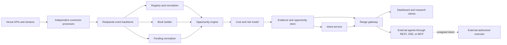

# Range — Arbitrage and Funding Intelligence Design

**Status:** Approved architecture specification  
**Date:** 2026-09-20  
**Hackathon focus:** Track 1 — arbitrage and funding opportunities  
**Product type:** Data and decision-support interface for humans, applications, and agents

## 1. Executive summary

Range is a real-time intelligence platform for tokenized-stock and equity-perpetual markets. It collects market and funding data from multiple venues, maps venue-specific products to canonical instruments, evaluates executable arbitrage and funding opportunities, and exposes the results through a dashboard, REST API, streaming API, and MCP server.  
 
Range is deliberately not a trading bot. It does not keep trading credentials, sign transactions, submit orders, or manage withdrawals. When requested, it turns a current actionable opportunity into a standardized, expiring **unsigned trade intent**. An independently authorized human or execution agent applies its own policy and decides whether to execute it.

The architecture is event-driven so that each venue connector can fail, recover, and scale independently. Bitget is a first-class venue and a required part of the initial demonstrator, not a decorative integration.

## 2. Goals and non-goals

### Goals

1. Normalize fragmented tokenized-stock spot, equity-perpetual, price, depth, and funding data.
2. Detect cross-venue price arbitrage, spot-perpetual basis, and funding-rate opportunities using executable depth rather than headline prices.
3. Make every result explainable through source timestamps, input events, calculation versions, explicit costs, and rejection reasons.
4. Give software agents a safe, typed interface through MCP while keeping REST and streaming interfaces available to ordinary applications.
5. Produce constrained unsigned trade intents that an external executor can independently validate, sign, submit, or reject.
6. Make it straightforward to add or quarantine venues without changing the core opportunity engine.
7. Provide a reproducible Docker Compose deployment for the hackathon and preserve a credible path to production hardening.

### Non-goals

- Automated order submission, signing, custody, withdrawals, or portfolio management.
- Storing venue trading keys or wallet private keys.
- Dividend capture, dividend prediction, or dividend-adjusted hedging.
- Capital-rotation analytics, which remains a separate Track 3 concept.
- Treating stale, delayed, or indicative quotes as executable liquidity.
- Promising risk-free or guaranteed returns.

## 3. Product principles

### Executability over appearance

An apparent spread is not an opportunity until Range accounts for available depth, fees, slippage, funding timing, financing, gas, FX conversion, and an uncertainty buffer. Capacity is computed at a requested notional and bounded by the weakest leg.

### Time is part of every value

Every observation carries source time, receive time, freshness state, and provenance. Range must never silently combine observations that exceed the allowed synchronization or freshness window.

### Evidence before intent

An intent can only be derived from an existing actionable opportunity. Callers cannot invent arbitrary venue legs through the intent endpoint.

### Read-only core

Range ends at an unsigned, expiring description of a possible trade. Execution stays outside the Range trust boundary.

### Honest degradation

Partial data is explicitly marked partial. A degraded venue may remain visible for research, but it cannot silently contribute to an actionable opportunity.

## 4. Venue strategy

The venue matrix is capability-driven. Connector presence does not imply that every venue can supply every product type.

| Venue connector | Intended role | Initial status | Notes |
|---|---|---:|---|
| `bitget` | Perpetual prices, depth, funding, and Bitget tokenized-stock/rToken data where available | Required in first release | Anchor integration for the hackathon; live symbol and product coverage must be discovered from the API rather than hard-coded. |
| `ondo_stocks` | Tokenized-stock spot/reference market data | Initial | Kept separate from Ondo Perps, with `venue_family=ondo`. |
| `ondo_perps` | Equity-perpetual prices, depth, funding, candles, and open interest | Initial | Separate connector and health state from Ondo Stocks. |
| `hyperliquid_hip3` | Equity-perpetual comparison venue | Initial | Uses HIP-3 market metadata and feeds. |
| `bybit` | Perpetual comparison venue where supported instruments exist | Initial candidate | Connector capability discovery determines eligible stock-linked products. |
| `qfex` | Equity/RWA perpetual comparison venue | Initial candidate | Confirm live instruments, fees, funding semantics, and access during connector spike. |
| `lighter` | RWA/equity perpetual comparison venue | Initial candidate | Treat market specifications and live API metadata as authoritative. |
| `extended` | Equity-perpetual comparison venue | Initial candidate | Confirm live products and funding fields during implementation. |
| `aster` | Additional perpetual venue | Initial candidate | Include only products positively identified as stock-linked or suitable hedges. |
| `variational` | Research/reference source | Delayed/reference only | Cached quotes must never create actionable intents. |
| `pacifica` | Possible future perpetual venue | Watchlist | Enable only after stock-linked product support is verified. |
| `nado` | Possible future equity venue | Watchlist | Enable only after equities are live and API semantics are verified. |

All capability claims are revalidated from live venue metadata at startup and periodically thereafter. A connector publishes capability flags such as `spot`, `perpetual`, `tokenized_stock`, `orderbook`, `funding_current`, `funding_history`, and `open_interest`.

## 5. Opportunity classes

Range supports three initial strategy types.

### 5.1 Cross-venue perpetual price arbitrage

Buy the cheaper perpetual and sell the more expensive equivalent perpetual on another venue. Range evaluates executable price at depth on both legs and includes expected funding through the configured holding horizon.

Primary risks are non-atomic fills, mismatched contract specifications, different settlement assets, mark-price behavior, funding divergence, and venue availability.

### 5.2 Spot-perpetual basis

Buy a tokenized-stock spot instrument and short an equivalent equity perpetual, or evaluate the reverse configuration when the instruments and borrow mechanics permit it. The first release treats reverse cash-and-carry as unsupported unless borrow availability and cost are directly observable.

Primary risks are basis persistence, redemption or transfer restrictions, market-hours behavior of the reference equity, custody, collateral denomination, and funding changes.

### 5.3 Funding-rate differential

Hold offsetting perpetual positions on equivalent underlyings when the expected funding receipts exceed expected payments and all trading costs over the holding window.

Range compares actual settlement schedules rather than merely annualizing displayed rates. Historical funding is evidence for research; predicted or current funding is labeled separately and never presented as guaranteed income.

## 6. System architecture



### 6.1 Connector fleet

Each venue runs as an independent process built on a shared connector SDK. The SDK defines lifecycle, retry, clock measurement, rate-limit handling, capability discovery, symbol discovery, raw-event capture, health reporting, and canonical adapter contracts.

Connectors do not calculate opportunities. They emit raw and minimally parsed venue facts. One failed venue cannot block other connectors.

`ondo_stocks` and `ondo_perps` are separate connectors even though they share `venue_family=ondo`; they have different products, APIs, failure modes, and freshness budgets.

### 6.2 Event backbone

Redpanda is the durable event transport. Initial canonical topics are:

- `market.raw.v1`
- `market.observation.v1`
- `book.state.v1`
- `funding.observation.v1`
- `venue.health.v1`
- `opportunity.v1`
- `evidence.bundle.v1`
- `intent.lifecycle.v1`

Events contain a schema version and calculation-relevant identifiers. Market topics are partitioned by canonical instrument and venue so ordering is preserved within a feed without forcing global ordering.

### 6.3 Canonical data plane

The registry maps venue symbols and contract specifications to a canonical underlying and product identity. The normalizer converts quantities, price scales, settlement currencies, contract multipliers, funding intervals, and timestamp formats without hiding the source representation.

The book builder maintains executable order-book state only when snapshots and deltas are sequence-consistent. The funding normalizer distinguishes current, predicted, and realized rates and records the exact next settlement time.

### 6.4 Opportunity and evidence plane

The opportunity engine joins synchronized canonical data, proposes candidates, and passes them through the cost/risk model. The model produces both accepted and rejected evaluations. Accepted candidates become actionable only while all freshness, capacity, quality, and product-equivalence rules hold.

The evidence service preserves the exact input event IDs, model version, assumptions, and output values needed to explain or replay each result.

### 6.5 Gateway and agent plane

One application service powers REST, SSE, and MCP. Interface adapters call the same internal functions; they do not duplicate calculation logic. The gateway authenticates clients, enforces scopes and rate limits, writes audit events, and returns typed responses with evidence references.

## 7. Canonical model

### 7.1 Instrument

Required fields include:

- `instrument_id`
- `underlying_id`
- `product_type`: `tokenized_spot` or `perpetual`
- `venue` and optional `venue_family`
- `venue_symbol`
- `quote_asset`, `settlement_asset`, and `collateral_asset`
- `contract_multiplier`
- `tick_size`, `lot_size`, and `minimum_notional`
- `trading_schedule`
- `funding_interval` where applicable
- `capabilities`
- `effective_from` and metadata version

Two venue products are not considered equivalent merely because their tickers look alike. Equivalence requires an explicit registry mapping and compatible economic exposure.

### 7.2 Observation envelope

Every market fact is wrapped in an envelope containing:

- `event_id`
- `schema_version`
- `venue`
- `instrument_id`
- `source_timestamp`
- `received_timestamp`
- `sequence` when supplied by the venue
- `transport`
- `freshness_budget_ms`
- `quality_flags`
- raw payload reference or hash

### 7.3 Derived objects

#### `ExecutableQuote`

Captures side, requested notional, volume-weighted executable price, worst price, filled quantity, depth utilization, source book event, and age.

#### `FundingProjection`

Captures rate type, current or predicted rate, interval, next settlement, holding horizon, expected settlements, position side, expected cash-flow basis points, and source observations.

#### `Opportunity`

Captures strategy, underlying, evaluated legs, gross spread, funding contribution, fee/slippage/financing/gas/FX costs, uncertainty buffer, net edge, measured capacity, freshness, status, expiry, and rejection reasons.

#### `EvidenceBundle`

Captures all source event IDs, calculation version, canonical mappings, assumptions, intermediate values, warnings, and a deterministic hash.

#### `UnsignedIntent`

Captures opportunity ID, constrained notional, derived legs, side, quantity, price bounds, expiry, non-atomicity warning, required preflight checks, evidence hash, and idempotency key. It contains no signature, nonce, API secret, or executable credential.

#### `VenueHealth`

Captures connection state, last event age, clock skew, sequence integrity, rate-limit state, capability changes, error counters, and quarantine reason.

## 8. Opportunity calculation

At a requested notional, Range computes:

```text
net_edge_bps = gross_spread_bps
             + expected_funding_bps
             - trading_fees_bps
             - slippage_bps
             - financing_bps
             - gas_and_transfer_bps
             - fx_conversion_bps
             - uncertainty_buffer_bps
```

The calculation uses executable bid/ask depth, not mid-price. The maximum supported notional is the minimum capacity across all legs after venue limits and configured depth-utilization caps.

Funding is evaluated across actual settlement boundaries within the requested holding horizon. The decision path uses horizon cash flow, not a misleading annualized comparison. Range displays realized historical funding separately from current or predicted funding.

An opportunity becomes actionable only when:

1. Instrument equivalence is explicit and current.
2. All required observations are within strategy-specific freshness and synchronization budgets.
3. Books are sequence-consistent.
4. Funding semantics and settlement times are known for funding-sensitive strategies.
5. Capacity meets the requested or minimum notional.
6. Net edge exceeds the configured threshold after the uncertainty buffer.
7. No required venue is degraded or quarantined.

## 9. Lifecycle and expiry

```text
Observed → Validated → Actionable → Intent ready → Expired
                 ↘ Rejected          ↘ Changed / Rejected
```

Rejections are stored with machine-readable codes such as:

- `STALE_INPUT`
- `UNSYNCHRONIZED_INPUTS`
- `BOOK_SEQUENCE_GAP`
- `UNKNOWN_INSTRUMENT_EQUIVALENCE`
- `INSUFFICIENT_DEPTH`
- `NET_EDGE_BELOW_THRESHOLD`
- `FUNDING_SEMANTICS_UNKNOWN`
- `VENUE_DEGRADED`
- `CLOCK_SKEW_EXCEEDED`
- `CAPABILITY_WITHDRAWN`

Default maximum intent lifetimes are policy limits, not promises:

- Fast price-spread intent: normally no more than 2 seconds.
- Spot-perpetual basis intent: normally no more than 5 seconds.
- Funding intent: normally no more than 30 seconds and always requires a fresh preflight.
- Delayed or reference-only data: cannot create an actionable intent.

Intent validation can return `valid`, `changed`, `expired`, or `rejected`. A changed intent is never silently substituted for the original; the caller must explicitly accept the new values.

## 10. Public interface

### 10.1 REST API

Initial endpoints are:

- `GET /v1/venues` — capabilities, freshness budgets, and health.
- `GET /v1/instruments` — canonical instruments and venue mappings.
- `GET /v1/markets/snapshot` — synchronized books, executable prices, and funding.
- `GET /v1/opportunities` — filters by strategy, underlying, edge, capacity, venue, and age.
- `GET /v1/opportunities/{id}` — calculation, evidence, warnings, and rejection history.
- `POST /v1/opportunities/{id}/intent` — create a constrained expiring unsigned intent.
- `POST /v1/intents/{id}/validate` — refresh evidence and revalidate before external execution.

SSE streams opportunity and venue-health changes. WebSocket support is reserved for cases that genuinely need bidirectional session control; it is not required for ordinary subscriptions.

### 10.2 MCP server

The initial MCP tools are:

- `list_venues`
- `find_instruments`
- `get_market_snapshot`
- `compare_funding`
- `scan_opportunities`
- `inspect_opportunity`
- `create_unsigned_intent`
- `validate_unsigned_intent`

The production transport is Streamable HTTP at `/mcp`. Stdio is supported for local development and agent integration tests.

Tool inputs and outputs use versioned JSON schemas, bounded result sizes, explicit units, and descriptive errors. Discovery metadata makes it clear that Range provides analysis and unsigned intents, not execution.

### 10.3 Shared response envelope

```json
{
  "status": "ok | partial | rejected",
  "as_of": "source-aligned timestamp",
  "freshness": { "oldest_input_ms": 184 },
  "result": {},
  "evidence": [{ "event_id": "evt_..." }],
  "warnings": ["legs are non-atomic"],
  "trace_id": "rng_trace_..."
}
```

Partial responses name missing or degraded venues. They never silently backfill live results with stale data.

### 10.4 Agent flow

1. **Scan:** The agent supplies strategy, asset set, minimum edge, holding horizon, and notional.
2. **Inspect:** It reads exact books, funding, costs, capacity, input age, and warnings.
3. **Create intent:** Range derives constrained legs from the approved opportunity ID.
4. **Validate:** Range refreshes inputs and returns `valid`, `changed`, `expired`, or `rejected`.
5. **Handoff:** An external executor applies its own controls and signs, submits, or rejects the trade.

The requested notional is clamped to measured capacity. An intent includes mandatory price bounds, TTL, evidence hash, and preflight requirements.

## 11. Access control and trust boundary

Range client scopes are:

- `market:read`
- `opportunity:read`
- `intent:create`

Intent creation requires an `Idempotency-Key`. Rate limits are applied per client and operation, with tighter budgets for expensive scans. The audit trail records caller identity, filters, opportunity ID, evidence hash, result, and expiry.

Venue credentials, where required for market-data access, must be read-only and stored through a secret manager or environment injection. Range API tokens are stored as hashes and use scoped permissions.

Range must not accept or store:

- private keys or seed phrases;
- withdrawal credentials;
- trading-enabled exchange secrets;
- user-supplied signed transactions;
- arbitrary order legs presented as if they were Range-derived intents.

## 12. Storage and replay

- **Redpanda:** ordered durable transport and replay source for recent events.
- **Redis:** current books, latest funding, health, active opportunities, and short-lived intent state.
- **TimescaleDB/Postgres:** canonical metadata, queryable observations, opportunity history, rejection history, and audit records.
- **Object storage:** compressed immutable raw-event archives and recorded connector fixtures for long-horizon replay.

Storage retention is configurable. Calculation-relevant events must outlive any opportunity or intent audit record that references them, or the record must preserve an immutable archive reference and content hash.

## 13. Reliability and failure containment

| Failure | Required behavior |
|---|---|
| Feed disconnect | Mark the venue degraded, expire affected opportunities, reconnect with exponential backoff, and resume from a clean snapshot. |
| Book sequence gap | Invalidate the book immediately and block actionable price opportunities until snapshot and deltas are consistent. |
| Stale or delayed input | Keep it visible as reference data if useful, but block intent creation and report the freshness violation. |
| Excess clock skew | Quarantine observations outside the venue-specific tolerance and alert on source/receive-time divergence. |
| Funding ambiguity | Exclude the leg when interval, settlement time, or realized-versus-predicted semantics cannot be normalized. |
| Rate limiting | Honor venue backoff, expose degraded coverage, and avoid substituting cached data without labeling it. |
| Service restart | Rebuild current state deterministically from the event log and preserve evidence and calculation identifiers. |
| Capability change | Withdraw affected products from new scans and expire active opportunities that depend on the capability. |

Release gates are:

1. **Zero silent staleness:** every result exposes age, degraded inputs, and exclusions.
2. **Fast live path:** target p95 observation-to-opportunity publication below 500 ms for streaming venues in the reference deployment.
3. **Deterministic recovery:** the same event log and calculation version reproduce the same opportunity values and evidence hash.

## 14. Deployment

### Hackathon deployment

Docker Compose runs:

- selected independent venue connectors;
- single-node Redpanda;
- Redis;
- Postgres with TimescaleDB;
- canonical-data services;
- opportunity, evidence, and intent services;
- Range gateway and MCP server;
- Range dashboard;
- observability collectors.

Kubernetes is not required for the demonstrator. Container and event boundaries stay production-shaped while Compose keeps local development and judging reproducible.

### Production hardening path

- Replicated Redpanda and database services.
- Horizontal gateway, book-builder, and opportunity-engine replicas.
- Managed secret storage and service identities.
- Multi-zone deployment and autoscaling based on event lag and API load.
- Backups, point-in-time recovery, and tested replay procedures.
- Network policies and encrypted service-to-service transport.

## 15. Observability

Structured logs, metrics, and OpenTelemetry traces are joined by `trace_id`, `event_id`, `opportunity_id`, and `evidence_hash`.

Required operational signals include:

- connector lag, disconnects, reconnects, and rate-limit state;
- book sequence gaps and resynchronization duration;
- clock skew and freshness-budget violations;
- capability and symbol changes;
- accepted and rejected candidate counts by reason;
- opportunity age, capacity, net edge, and expiry;
- intent creation, validation outcomes, and expiry;
- REST/MCP latency and error rates;
- consumer lag, replay duration, and replay drift.

Alerts focus on data correctness and silent coverage loss before raw process availability.

## 16. Test strategy

### Adapter contract tests

Recorded venue fixtures cover symbol discovery, contract metadata, snapshots, deltas, funding fields, pagination, authentication, rate limits, malformed messages, and capability changes.

### Canonical and schema tests

Schema compatibility tests prevent breaking event consumers. Instrument mappings and unit conversions use explicit golden fixtures.

### Deterministic calculation tests

Golden cases cover executable prices, fees, funding settlement, FX, slippage, capacity, uncertainty buffers, and every rejection code.

### Replay and fault-injection tests

Captured streams are replayed with disconnects, sequence gaps, reordering, duplicates, stale clocks, partial venue failure, and service restarts. Recovery must not produce actionable results from invalid state.

### Interface parity tests

Equivalent REST and MCP requests must return the same typed result, evidence, freshness, and warnings. SSE events must agree with retrievable REST state.

### End-to-end lineage tests

Tests follow observation → normalized state → opportunity → evidence bundle → unsigned intent → validation and verify references and hashes at every boundary.

### Strategy evaluation

Historical replay and a held-out evaluation window report:

- candidate count and actionable count;
- gross and net edge distributions;
- capacity at multiple notional sizes;
- opportunity half-life and edge decay;
- funding realized versus projected;
- rejection-reason distribution;
- stale-data and false-positive rates.

Backtest results are research evidence, not profit guarantees.

## 17. Initial delivery sequence

This is architectural sequencing, not the task-level implementation plan.

1. Establish the monorepo, shared schemas, connector SDK, local infrastructure, and health model.
2. Implement Bitget plus one tokenized-stock source and one independent equity-perpetual comparison venue.
3. Implement canonical mapping, sequence-safe books, and funding normalization.
4. Build deterministic cost, opportunity, rejection, and evidence services.
5. Expose REST, SSE, and MCP through the shared application layer.
6. Add unsigned intent creation and validation behind explicit scopes.
7. Build the dashboard and end-to-end demonstration flow.
8. Add further venue connectors through the adapter contract and publish measured coverage.

## 18. Demonstration scenario

The hackathon demo should show one underlying mapped across Bitget and at least two additional venues:

1. Live venue health and canonical instrument mapping.
2. Synchronized executable quotes and funding schedules.
3. A candidate changing from observed to actionable or rejected as inputs change.
4. Full net-edge calculation and evidence lineage.
5. The same opportunity queried through the dashboard and an MCP tool.
6. Creation of an unsigned, expiring intent.
7. A deliberate stale-feed or sequence-gap fault that immediately invalidates the opportunity.
8. External handoff without Range holding a trading credential or submitting an order.

## 19. Acceptance criteria

The design is implemented successfully when:

- Bitget supplies real data to the canonical pipeline and participates in demonstrated opportunity evaluation.
- At least three live venue connectors operate through the shared connector contract.
- A delayed/reference venue cannot create an actionable opportunity.
- All displayed opportunities show executable prices, net edge, capacity, freshness, costs, and evidence.
- REST and MCP return equivalent results for equivalent requests.
- Unsigned intents can only be created from currently actionable opportunities and can be revalidated or expired.
- Feed disconnect, sequence-gap, and stale-data tests prevent unsafe results.
- No trading or withdrawal credential is required anywhere in Range.

## 20. Implementation-time validations

Before enabling any venue for actionable scans, the connector spike must verify:

- currently live stock-linked symbols and jurisdictions;
- public versus authenticated market-data access;
- rate limits and permitted data use;
- order-book sequence and snapshot rules;
- contract multiplier, settlement, collateral, and mark/index definitions;
- funding rate type, interval, next settlement, and history semantics;
- maker/taker fees and any product-specific costs;
- maintenance windows and behavior outside underlying equity-market hours.

If any field cannot be verified, the venue remains research-only or disabled for the affected strategy.

## 21. Reference documentation

- [Bitget API documentation](https://www.bitget.com/api-doc/contract/intro)
- [Ondo Global Markets API](https://docs.ondo.finance/api-reference/overview)
- [Ondo Perps REST specification](https://docs.ondoperps.xyz/api-reference/rest-spec.json)
- [Hyperliquid perpetual API](https://hyperliquid.gitbook.io/hyperliquid-docs/for-developers/api/info-endpoint/perpetuals)
- [Bybit V5 documentation](https://bybit-exchange.github.io/docs/v5/intro)
- [QFEX API documentation](https://docs.qfex.com/)
- [Lighter RWA market specifications](https://docs.lighter.xyz/trading/real-world-assets-rwas/market-specifications)
- [Extended API documentation](https://api.docs.extended.exchange/)
- [Aster API documentation](https://github.com/asterdex/api-docs)
- [Variational API documentation](https://docs.variational.io/technical-documentation/api)
- [Pacifica documentation](https://pacifica.gitbook.io/docs/)
- [Nado documentation](https://docs.nado.xyz/)
- [Model Context Protocol Python SDK](https://github.com/modelcontextprotocol/python-sdk)

